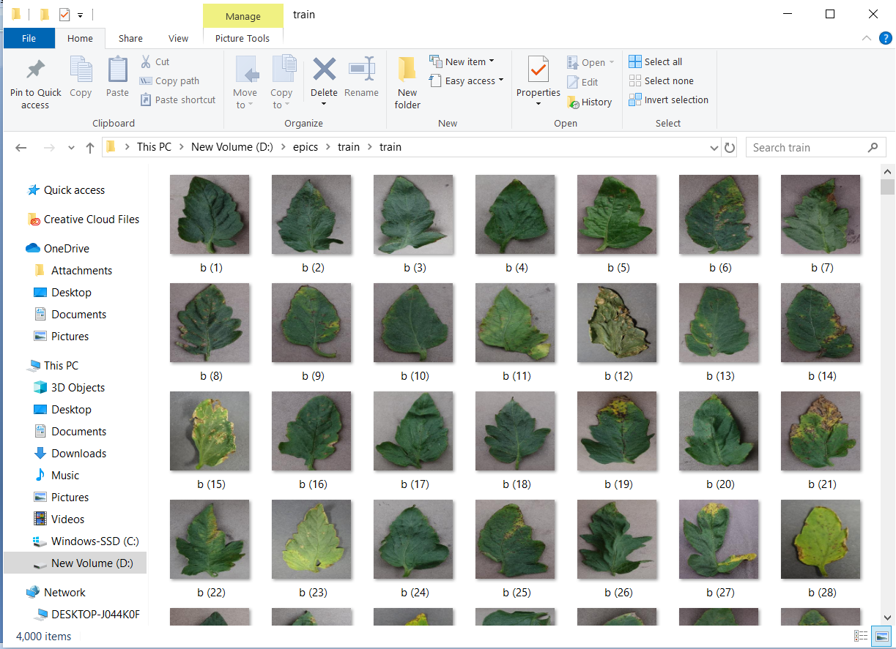
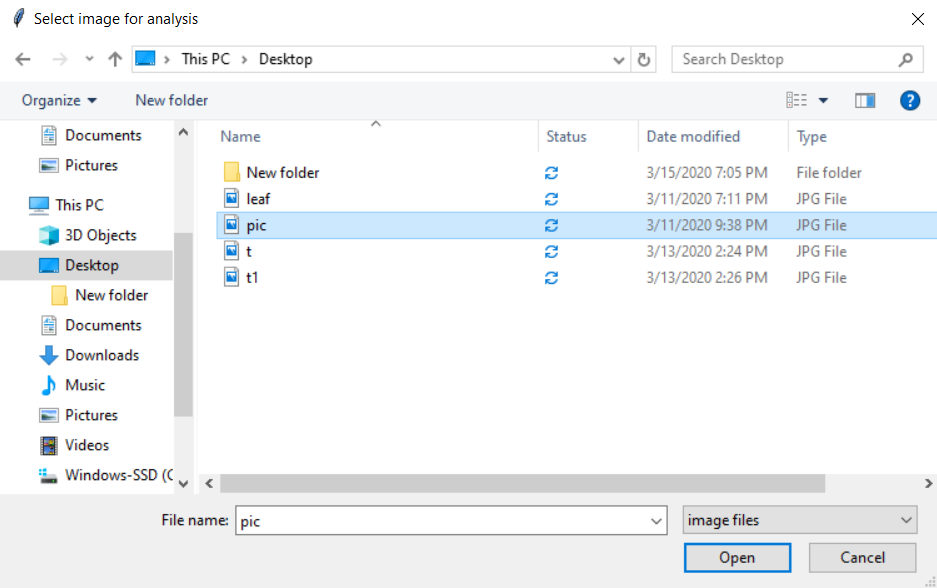
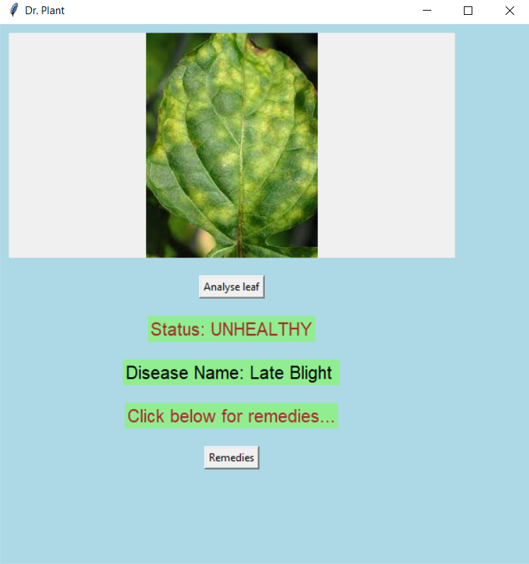
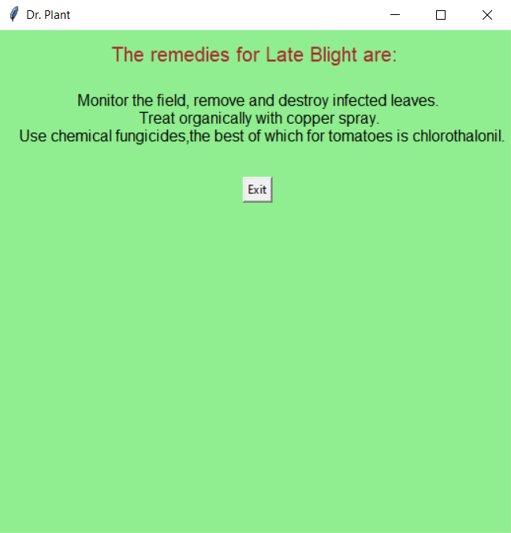

# Disease-identification-in-plants_CNN
<h2> 4 Diseases </h2>

<h4><b> Bacterial_spot, Early_blight, Late_blight, Septoria_leaf_spot </b></h4>

<h2><b> Abstract: </b></h2>

By gathering the leaves and training them, we  use this  training data to  train our classifier and then output will be predicted with optimum accuracy. We use Convolution Neural Network(CNN) which comprises of different layers which are used for prediction. Some important steps are used for detection like featureextraction and for classification of images we are using CNN, Deep Learning. Proposed model helpsto reduce efforts or hard work of farmers for monitoring big farms and related diseases to farm and crops.

<h2><b> Requirements: </b></h2>
The dataset of tomato plant is available here.
  

Download the dataset from [here](https://drive.google.com/file/d/1lw5J29JfjF54CIPm6b3qV_c23dEVBbQf/view?usp=sharing)

     training_data.py - to generate train images and train labels
     
<h2><b> Screenshots: </b></h2>

* Train dataset.

* When gui application  get started the following image window will be displayed.

* Below window will be opened now you can redirect to the required directory to select the leaf.

* After clicking open button you will be getting the following the window. Now click on analyse leaf button to analyse the leaf.

* The corresponding disease will be shown on the window.

* If you want remedies the you can press Remedies button.  

<h2> 10 diseases </h2>

* Identifying upto 10 diseases in tomato plant at its starting stage.
* cnn.py is used to train and test the model 
* ui.py is used for finding the disease in the given leaf by the user.

<b><H2> Package Requirements: </h2></b>
1. Download the repository by clicking on the download button or type the following command in CMD to clone the repository:

       git clone https://github.com/AkhilaMadduri/Disease-identification-in-plants_CNN-10-diseases.git
2. Download the dataset from [here](https://drive.google.com/open?id=1DVy0LyUUfJciyo7BUFm1sHKSRdTVJgjF)
3. numpy (pip install numpy) 
4. tqdm (pip install tqdm) 
5. TensorFlow openCv matplotlib

